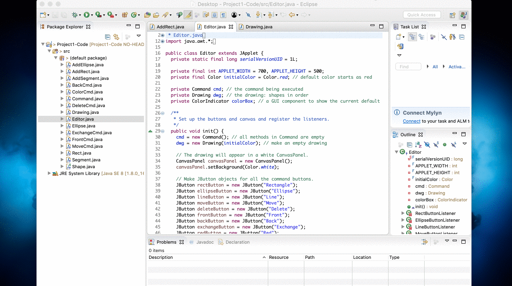

# shape-editor
CSC 260 Project 1 - Use inheritance in two ways to create a simple object-oriented graphical editor applet.
It runs as an applet so you will need to run it from within Eclipse or IntelliJIDEA.

Project Description:

The graphical editor allows its user to create and edit three kinds of graphical objects in a drawing —rectangles, ellipses, 
and line segments—. The objects are linearly ordered, from front to back, so that if two objects overlap, the one in front is 
what you see. Each object can appear in either red, green, or blue. The editing operations allow you to change an object's color, 
to move an object by dragging it, to delete an object, to move an object to the front of the linear order, to move an object to 
the back of the linear order, and to exchange the locations of two objects.

The editor has a simple, button-based GUI. Below the command buttons is a white canvas upon which all graphical objects appear. 
Initially the drawing is empty. The graphical editor maintains, at all times, the notion of a default color: the color in which 
added objects will be drawn. The default color appears in the GUI in a color indicator box, and initially the default color is red.

The press of a command button specifies how the editor is to react to click, press, and drag events in the canvas. The editor 
will continue reacting in that way until the next time that a command button is pressed. Here is how each of the buttons is to work:

Rectangle:

After clicking the Rectangle button, you may drag out a rectangle on the canvas, from corner to corner. The rectangle continually 
appears on the canvas, and when the mouse is released, the rectangle is added to the drawing. The rectangle is drawn in the current 
default color, even as it is being dragged out.

Ellipse:

After clicking the Ellipse button, you may drag out an ellipse on the canvas, from corner to corner of the bounding box. The ellipse 
continually appears on the canvas, and when the mouse is released, the ellipse is added to the drawing. The ellipse is drawn in the 
current default color, even as it is being dragged out.
Note: Although we call the shape an ellipse, you will need to call the fillOval method to draw ellipses. (Geometrically, the shape 
really is an ellipse, but the AWT calls the method fillOval, not fillEllipse.)

Line:

After clicking the Line button, you may drag out a line segment on the canvas, from endpoint to endpoint. The line segment continually 
appears on the canvas, and when the mouse is released, the line segment is added to the drawing. The line segment is drawn in the 
current default color, even as it is being dragged out.

Move:

After clicking the Move button, you may drag any object on the canvas. The frontmost object that is under the mouse position at the 
time that dragging starts (i.e., the button is pressed while the mouse is in the canvas) is the one that is moved. It is not an error 
for no object to be under the mouse position when dragging starts, but no object is moved in this case.

Delete:

After clicking the Delete button, any time there is a click in the canvas, the frontmost object that is under the mouse position at 
the time of the click is deleted from the drawing. It is not an error for no object to be under the mouse position when a click occurs, 
but no object is deleted in this case.

Front/Back:

After clicking the Front or Back button, any time there is a click in the canvas, the frontmost object that is under the mouse position 
at the time of the click is moved to either the front or back of the linear ordering of objects in the drawing. It is not an error for 
no object to be under the mouse position when a click occurs, but no object is moved to the front or back in this case.

Exchange:

After clicking the Exchange button, any time two objects are clicked, they exchange their positions on the canvas. That is, if object X 
is the frontmost object that is under the mouse position at the time of a click, and then object Y is the frontmost object that is under 
the mouse position at the time of a second click, this command moves X to have the same center that Y had, and it moves Y to have the 
same center that X had. It is not an error for no object to be under the mouse position when a click occurs. This command works on 
objects in distinct pairs, so that if you click on objects X, Y, and Z, then X and Y exchange centers, and Z remains unchanged until 
such time as another object is clicked.

Red/Green/Blue:

After clicking the Red, Green, or Blue button, two things happen. First, the default color (the color in which new objects are added) 
changes to the appropriate color, and the color indicator box changes color. Second, any time there is a click in the canvas, the 
frontmost object that is under the mouse position at the time of the click has its color changed appropriately. It is not an error for 
no object to be under the mouse position when a click occurs, but no object has its color changed in this case.

